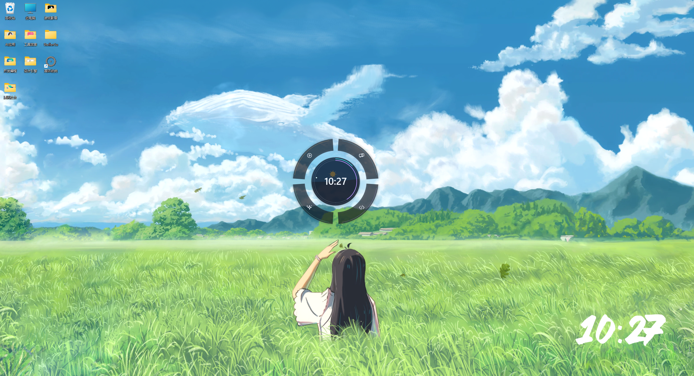
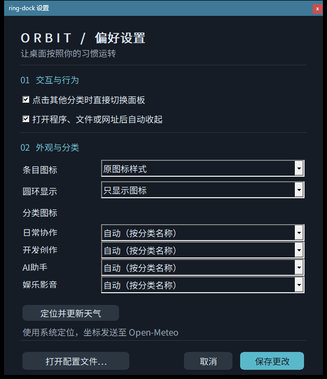

# Ring Dock

**把常用应用、文件和文件夹放进桌面上的透明圆环。** 点击分类展开快捷面板，点一下即可打开收藏。适用于 Windows 10/11 x64，免安装，支持鼠标操作。

<p align="center">
  
</p>

## 下载和启动

1. 打开 **[最新版本下载页](https://github.com/stollor/ring-dock/releases/latest)**，下载 `ring-dock-v...-windows-x64.zip`。
2. 将压缩包解压到你有写入权限的文件夹，例如 `%LOCALAPPDATA%\Programs\RingDock`。
3. 双击 `ring-dock.exe`。程序会把设置保存在 exe 同目录的 `config.json`。

程序自带圆环应用图标。想放到桌面时，右键 `ring-dock.exe` 创建快捷方式；快捷方式会使用 exe 内嵌图标。

### 使用 AI 安装并整理桌面图标

复制下面的提示词，交给能操作本机 Windows、PowerShell 和桌面的 AI 助手。提示词会让 AI 下载正式版、创建带圆环图标的桌面快捷方式，并把桌面快捷方式自动收纳到分类面板。完整说明也可看[单独的提示词文档](docs/AI安装与图标整理提示词.md)。

````text
请在我的 Windows 电脑上安装 Ring Dock，并把桌面图标收纳到圆环分类里。请实际操作浏览器、PowerShell 和 Windows 桌面，不要只给我步骤。项目官方仓库是 https://github.com/stollor/ring-dock 。

1. 从 https://github.com/stollor/ring-dock/releases/latest 下载最新的 `ring-dock-v...-windows-x64.zip` 和同一 Release 的 `SHA256SUMS.txt`。不要下载源码包或第三方 exe。用 `Get-FileHash -Algorithm SHA256` 核对 ZIP；校验不一致或没有该文件时停止。
2. 解压到 `%LOCALAPPDATA%\Programs\RingDock`。如果目录已有 `config.json`，保留它和原收藏，不要用默认配置覆盖。启动 `ring-dock.exe` 一次，并等到同目录的 `config.json` 存在。
3. 如果启动时出现 UAC，先向我说明这是为了运行可选的 WinMemoryCleaner 内存整理助手，并等待我自己决定；不要替我点击 UAC。拒绝后继续使用圆环。
4. 在桌面创建或更新 `ring-dock.exe` 的快捷方式，图标位置设为该 exe 路径、索引 0，使用程序内嵌的圆环图标。不要从网上另找图标，不要重复创建快捷方式。
5. 用下面命令下载与当前 Release 标签完全匹配的官方桌面导入脚本。把 `$installDir` 改成实际安装目录；先做只读预览，再自动导入。导入脚本递归扫描当前用户桌面和公共桌面的 `.lnk`、`.url`、`.website`、`.appref-ms` 快捷方式，按来源文件夹或目标类型分类，跳过已收藏路径；它不会执行快捷方式、移动/删除源文件或上传配置。正式导入前会在配置旁创建备份。

```powershell
$installDir = Join-Path $env:LOCALAPPDATA 'Programs\RingDock'
$configPath = Join-Path $installDir 'config.json'
$release = Invoke-RestMethod -Uri 'https://api.github.com/repos/stollor/ring-dock/releases/latest'
$scriptPath = Join-Path $env:TEMP ("ring-dock-import-" + $release.tag_name + '.ps1')
$scriptUrl = "https://raw.githubusercontent.com/stollor/ring-dock/$($release.tag_name)/tools/orbit/import_desktop.ps1"
$reportPath = Join-Path $env:TEMP ("ring-dock-import-" + [guid]::NewGuid().ToString('N') + '.json')
Invoke-WebRequest -Uri $scriptUrl -OutFile $scriptPath

try {
    powershell.exe -NoProfile -ExecutionPolicy Bypass -File $scriptPath -ConfigPath $configPath -ScanOnly -ReportPath $reportPath | Out-Null
    if ($LASTEXITCODE -ne 0) { throw '桌面快捷方式预览失败，停止导入。' }
    $preview = Get-Content -LiteralPath $reportPath -Raw -Encoding UTF8 | ConvertFrom-Json
    $preview | Select-Object discovered, added, duplicates
    $preview.items | Group-Object category | Select-Object Name, Count

    if ($preview.discovered -gt 0) {
        powershell.exe -NoProfile -ExecutionPolicy Bypass -File $scriptPath -ConfigPath $configPath -ReportPath $reportPath | Out-Null
        if ($LASTEXITCODE -ne 0) { throw '桌面快捷方式导入失败，请保留现有配置。' }
        $result = Get-Content -LiteralPath $reportPath -Raw -Encoding UTF8 | ConvertFrom-Json
        $result | Select-Object added, duplicates, backup
    }
} finally {
    Remove-Item -LiteralPath $reportPath -Force -ErrorAction SilentlyContinue
    Remove-Item -LiteralPath $scriptPath -Force -ErrorAction SilentlyContinue
}
```

6. 导入脚本只处理快捷方式。把桌面根目录中未被导入的普通文件和文件夹，通过文件资源管理器拖到圆环对应分类的展开面板里收藏；跳过回收站、“此电脑”和用于分类的文件夹本身。只添加桌面上的项目，不继续扫描其他磁盘。拖入只收藏路径，不移动或删除原件。
7. 右键圆环打开“设置”，按我的桌面内容选择分类图标和圆环显示方式。不要运行或逐个打开桌面项目。不要把完整路径、导入报告或 `config.json` 内容贴到聊天里。
8. 最后告诉我安装目录、快捷方式位置、导入数量和分类数量、配置备份位置，以及卸载方法。不要删除我的源文件；卸载时先询问我是否保留 `config.json`。
````

> 首次启动时，如果检测到可选的 WinMemoryCleaner，程序会请求一次管理员权限来启动内存整理助手。拒绝授权不会阻止圆环运行，只会停用内存整理功能。

## 怎么用

| 操作 | 效果 |
| --- | --- |
| 点击圆环上的分类 | 展开该分类的快捷面板；再点一次收起 |
| 点击收藏项 | 打开对应的应用、文件、文件夹或网址 |
| 把文件或快捷方式拖到展开的面板 | 收藏它；原文件不会移动或删除 |
| 点击“整理” | 拖动条目调整顺序，点击减号移除收藏 |
| 按住鼠标中键拖动圆环或面板 | 移动挂件；松开后记住位置 |
| 右键圆环或托盘图标 | 打开设置、重新加载配置或退出 |

### 圆环上的信息

- **青色进度环**显示整台电脑的 CPU 使用率；**紫色进度环**显示整机物理内存使用率。
- **小圆点**是秒针标记，会随本地时间平滑移动，每分钟绕行一圈。
- **天气背景**会在启动时尝试读取 Windows 系统位置并获取当前天气；也可在设置中点击“定位并更新天气”。天气每 30 分钟自动刷新。圆心背景会按天气和昼夜显示晴天、云、雨雪与风等简单效果。

### 点击分类，展开对应收藏

每个扇区对应一个独立分类。点击后，收藏面板会显示该分类里的应用和快捷方式；下图以“AI 助手”分类为例。分类名称、图标和收藏内容都可以按自己的习惯调整。

<p align="center">
  
</p>

右键打开设置后，可以选择分类图标的显示方式、每个分类的图标、面板条目图标样式、时钟格式、透明度和布局。圆环图标可以自动匹配分类，也可以单独指定协作、开发、AI、娱乐、程序、文件、文件夹或网址图标。

<p align="center">
  
</p>

## 它有什么不同

- **圆环直接贴合桌面。** 正式窗口嵌入 Windows 桌面，不会置顶盖住正在使用的应用。
- **真实逐像素透明。** 能看到圆环下方的壁纸；界面是半透明玻璃质感，不提供实时背景模糊。
- **桌面图标照常使用。** 透明区域会把点击交给下面的桌面。
- **只收藏快捷方式和路径。** 加入或移除收藏不会搬动、删除原文件。
- **设置保存在本地。** 不上传收藏列表或个人配置。

## 下载包内容

每次发布 `v` 开头的版本标签后，GitHub Actions 会在 Windows 上构建程序，并生成 Windows x64 ZIP 与 SHA-256 校验文件。下载页面只提供 Ring Dock 本身；清理助手是可选组件，未安装时圆环和快捷面板仍可使用。

## 从源码构建

开发环境需要 Windows、Rust MSVC 工具链和 Windows SDK 资源编译器：

```powershell
cargo build --release --locked
```

生成的程序位于 `target\release\ring-dock.exe`。图标资源在 `assets\ring.ico`。

## 项目说明

Ring Dock 面向 Windows 桌面，使用 Rust、Direct2D、DirectWrite 与 Windows 分层窗口。当前主要验证环境为 Windows 11；其他 Windows 版本、桌面增强软件和多屏 DPI 组合尚未逐一验证。详见[当前能力与限制](docs/当前能力与限制.md)。

本仓库尚未声明开源许可证。你可以下载和运行发布包；公开可见不等于允许复制、修改或再发布源码。

遇到问题或想提出功能建议，可以到[问题反馈页](https://github.com/stollor/ring-dock/issues)。
